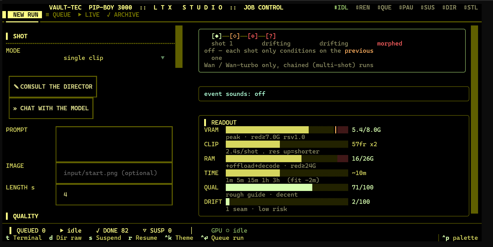
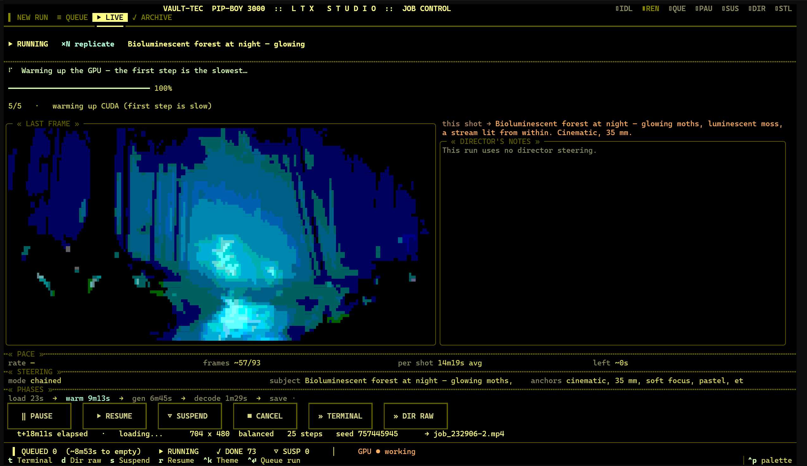
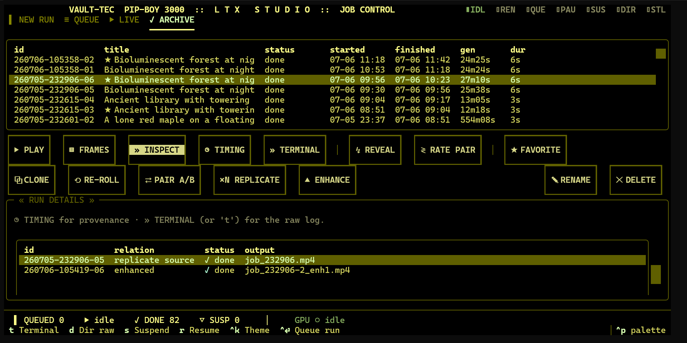
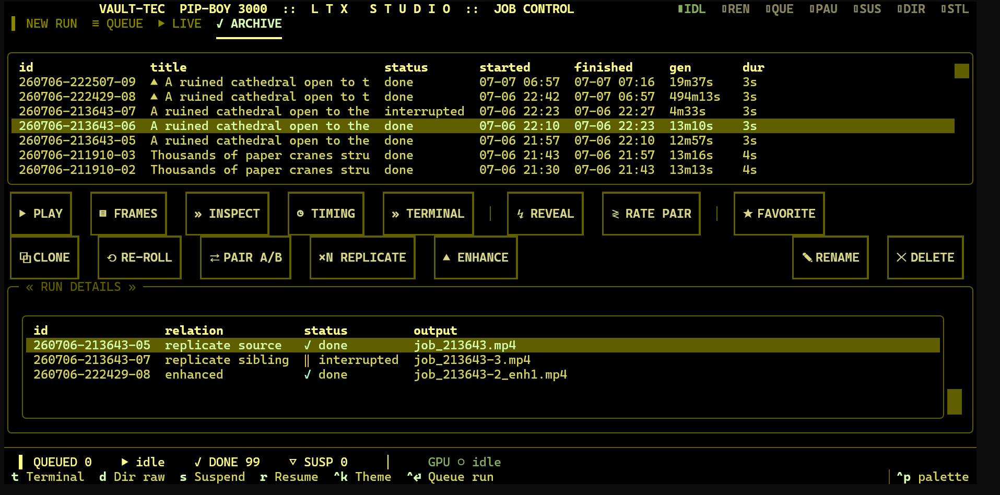

# LTX Studio

A local, offline AI-video studio that runs modern video-diffusion models on a **single 8 GB laptop GPU** — driven entirely from a terminal UI. No cloud, no API keys, open weights only.

LTX Studio wraps [LTX-Video](https://github.com/Lightricks/LTX-Video) and [Wan](https://github.com/Wan-Video) diffusion backends in a Pip-Boy–styled [Textual](https://textual.textualize.io/) TUI, and adds the layer those research repos leave out: a job queue, live previews, calibrated time estimates, a blind A/B harness, and a per-run experiment log so quality changes are empirically measured and traceable with full provenance.

It was built under a hard constraint — an RTX 5070 Laptop (Blackwell, `sm_120`) with 8 GB of VRAM *shared with the Windows desktop*, and most of the interesting engineering falls out of taking that constraint seriously. The payoff is everything cloud video-gen can't offer: it's free, private, and offline — no API keys, no per-second billing, nothing leaves the machine.

> **Status:** a working personal tool, iterated over many sessions. Single author. This repo is the studio and its orchestration; the model weights and the diffusion research code are external dependencies (see [Running it](#running-it)).

---

## What it looks like

**Job control** — the NEW RUN screen: dials on the left; a schematic for the focused dial (here BACKEND, laid out fast → nicer); a contextual INFO panel with per-backend knowledge baked in; and the self-calibrating READOUT (VRAM headroom, clip budget, system RAM, the shot chain, predicted quality, drift risk):



**A live render** — the worker subprocess streaming progress and a last-frame preview into the LIVE tab, with per-phase timing (load → warm → gen → decode → save):



**The archive** — every run is a first-class record: status, per-run timing, favorites, and the blind-comparison harness (REVEAL / RATE PAIR / PAIR A/B). INSPECT shows a run's full config beside an opening-frame preview, so near-identical runs — especially replicates — can be told apart without opening a player:



Scrolling the same panel reaches the lineage table — here a replicate source, a replicate sibling, and an enhanced child — so provenance survives re-rolls, replicates, and enhancement passes:



**Sample output** — all generated with the Wan backend, locally on the 8 GB laptop GPU:

| | |
|---|---|
|  |  |

*Left: fireflies over a glowing forest stream. Right: "bioluminescent forest at night — glowing moths, luminescent moss, a stream lit from within" (the run shown in the LIVE screenshot above). Full-quality clips: [job_105358-5.mp4](media/job_105358-5.mp4) · [job_232906-2.mp4](media/job_232906-2.mp4).*


*A corgi on the beach at golden hour — generated, upscaled ×4, and RIFE-interpolated end to end in about 15 minutes. Full clip: [corgi_redo-2.mp4](media/corgi_redo-2.mp4).*

**Two weeks in** — the first clip this project ever produced (June 22, the initial smoke test) happens to also be a dog on a beach. Next to it, the corgi above (July 6). No prior video-generation experience; same 8 GB card:

| June 22 — first output | July 6 |
|---|---|
|  |  |

*The difference between the two columns is the rest of this README.*

---

## Why it looks the way it does

Three principles drove almost every design decision.

**1. The UI process never touches CUDA.**
The Textual app (`studio.py`) does not import `torch`. Generation runs in a *separate* Python subprocess with its own CUDA context; the two communicate over a tiny one-way text protocol on stdout. This means a driver OOM or a CUDA segfault kills the worker, not the UI — the studio stays responsive, reports the failure, and lets you re-queue. It also means the 4,000-line UI stays testable without a GPU in the loop.

**2. Measure, don't guess.**
Every run appends a structured record to `runs/experiments.jsonl` — config, per-phase wall-clock, peak VRAM, and quality telemetry (seam MSE across shot boundaries, motion drift, token counts). The time-estimate model and the READOUT gauges *calibrate themselves from that log*. When you want to know whether a change actually helped, there's a **blind A/B harness** with a double coin-flip (it randomizes both the on-screen label *and* the render order) and a reveal gate, so you rate output without knowing which variant you're looking at.

**3. New behavior ships as an opt-in toggle, defaulting to the old output.**
A quality lever that silently changes results poisons every future comparison. So new features (drift anchors, context windows, distilled variants) are dials that default to the previous behavior — byte-identical output unless you opt in. Experiments stay honest across versions.

---

## Architecture

```
┌────────────────────────────────────────────────────────────────┐
│  studio.py          Textual TUI  ·  never imports torch          │
│  (~4,000 lines)     NEW RUN · QUEUE · blind A/B · READOUT meters  │
└─────────────────┬──────────────────────────────────────────────┘
                  │  spawns a worker subprocess, reads its stdout
                  │  parses  [[MARKER]]  lines   ◄── one-way protocol
┌─────────────────┴──────────────────────────────────────────────┐
│  studio_core.py     JobManager  ·  process lifecycle, marker     │
│  (~500 lines)       parsing, phase-timing provenance, run JSON   │
└─────────────────┬──────────────────────────────────────────────┘
                  │  argv  →  python director.py …  (own CUDA context)
┌─────────────────┴──────────────────────────────────────────────┐
│  director.py        Generation engine  ·  multi-shot chaining,   │
│  run_ltx.py         LTX / Wan backends, drift anchors, context   │
│  (~1,200 lines)     windows, preview + telemetry emission        │
└────────────────────────────────────────────────────────────────┘
```

### The marker protocol

The worker prints progress as line-oriented markers; `studio_core` parses them with regexes and updates job state. That's the entire coupling between the two processes — no shared memory, no RPC, no `torch` in the UI.

```
[[PHASE generating]]      ← phase boundary  → drives provenance + the progress budget
[[SEG 2/4]]               ← shot 2 of 4 started
[[STEP 12/20]]            ← denoising step within the current shot
[[PREVIEW /path.png]]     ← a fresh preview frame is on disk
[[VRAM 7.1]]              ← peak GB this phase
[[SEAMMSE 0.0043]]        ← boundary discontinuity between chained shots
[[DRIFT 0.11]]            ← accumulated motion drift vs. the anchor frame
[[CKPT 1]]               ← a resumable checkpoint was written
```

Because phase boundaries are explicit, the studio accumulates real per-phase timings (`load` / `warmup` / `generating` / `decoding` / `saving`) per run. Those feed two things: a **wall-time progress bar** that knows decoding is slow and weights the bar accordingly, and the **self-calibrating ETA** that reads back the experiment log.

---

## Feature tour

- **Pip-Boy TUI** — NEW RUN form, live QUEUE, and a persistent right-hand rail with field schematics and global READOUT meters. Responsive layout that restacks below 76 columns.
- **Themeable UI** — 21 hand-built Pip-Boy palettes, each modeled on a real reference object (vault suit, nixie tube, radium dial) rather than a hue rotation, plus an opt-in *ultra* tier of 14 animated themes. The ultra decorations render as pure functions of a frame clock on a dedicated 15 fps timer — zero footprint on the standard themes, with a `STUDIO_NO_ANIM` reduce-motion switch.
- **Blind A/B** — queue two variants of one config, rate them blind, reveal after. Ratings and pairings are logged to `runs/pair_*.jsonl`.
- **Live preview** — the worker decodes a preview frame mid-generation; the UI refreshes it on a wall-clock cadence so you can bail on a bad seed early.
- **READOUT gauges** — VRAM headroom, clip budget, system RAM, the shot chain, predicted quality, and drift risk, all auto-refit from your own run history so the scales mean something on *your* hardware.
- **Field schematics** — a right-rail « SCHEMATIC » panel draws the focused dial's trade-off axis with your current value marked on it, beside an « INFO » panel whose guidance is per-dial *and* per-backend.
- **Style presets** — named bundles of anchor words (`Cinematic`, `Golden Hour`, `Noir`, …) that append into the prompt, stackable and user-extensible via JSON.
- **Multi-shot director** — chains shots into longer clips with latent anchoring (AdaIN + palette lock) to fight drift, plus context windows so long clips don't OOM.
- **Three backends** — LTX-2B (pinned 0.9.5, optional 0.9.8-distilled transformer) for fast drafts, Wan-VACE-1.3B for fidelity, and a 4-step Wan-turbo DMD path — with each path's step/CFG clamps surfaced rather than hidden.
- **Archive with lineage** — every run is a first-class record: favorite, re-roll, clone, replicate, enhance, blind-pair verdicts, a lineage panel tracing each run's replicate source and enhanced children, and an opening-frame preview on inspect so near-identical runs are distinguishable at a glance.
- **Inspect & clone from the queue** — read-only provenance and one-click re-queue of any run's exact config.

---

## Repo map

| File | Role |
|------|------|
| `studio.py` | The Textual TUI — forms, queue, blind A/B, readout, layout. The centerpiece. |
| `studio_core.py` | `JobManager`: subprocess lifecycle, `[[MARKER]]` parsing, phase-timing provenance, per-run JSON. |
| `director.py` | Multi-shot generation engine: LTX/Wan backends, drift anchors, context windows, telemetry emission. |
| `run_ltx.py` | Single-clip LTX runner (the simple path). |
| `experiment_log.py` | Appends structured run records to `runs/experiments.jsonl` — the measurement backbone. |
| `readout.py` | The self-calibrating READOUT gauges. |
| `field_visuals.py` | ASCII block-art schematics for every form field. |
| `studio_themes.py` | Theme registry — 21 curated Pip-Boy palettes plus the 14-theme animated *ultra* tier. |
| `ultra_art.py` | Pixel-art / procedural decorations for the ultra themes — pure functions of a frame clock, never raises. |
| `style_presets.py` | Named anchor-word bundles for the STYLE dropdown. |
| `gpu_budget.py` | VRAM budgeting helpers for the 8 GB envelope. |
| `ltx_preview.py` | Mid-generation preview-frame decode/save. |
| `dials_help.py` | Help text for the dials. |
| `vlm_director*.py`, `vlm_planner.py` | Optional Qwen-VL sidecars for auto-prompting / shot planning. |
| `_q2tests/`, `_t22tests/` | CPU-only test harnesses (drift replay, hold-stress, readout units). |
| `_spikes/` | Research spikes (e.g. a Wan 2.2-5B smoke test) — kept as a record of what was tried. |

The launch scripts (`studio.sh`, `ltx.sh`, `ltx-studio.sh`) wire up the Python env and drop you into the TUI.

---

## Running it

LTX Studio orchestrates open-weights models it does **not** vendor. You supply:

- A Python 3.10 environment with the deps in `requirements.txt`.
- On Blackwell / RTX 50-series, a CUDA 12.8 build of PyTorch:
  `pip install torch --index-url https://download.pytorch.org/whl/cu128`
- The model weights (LTX-Video 2B, optionally Wan 2.1-VACE-1.3B), fetched on first run via `huggingface_hub` into a local cache.

Then:

```bash
./studio.sh          # launch the full studio TUI
```

Designed for WSL2 on Windows with an 8 GB GPU, but nothing is Windows-specific — it's a terminal app and a subprocess.

---

## Testing

The test harnesses are CPU-only by design — they exercise the parsing, telemetry, layout-fitting, and readout math without touching CUDA:

```bash
python _t22tests/test_readout.py     # readout gauge math + auto-refit
python _q2tests/test_units.py        # drift / seam telemetry units
```

The strict separation between the UI process and the CUDA worker is what makes this possible: the interesting logic lives on the testable side of the process boundary.

---

## License

MIT — see [LICENSE](LICENSE).
