# LTX Studio

A local, offline AI-video studio that runs modern video-diffusion models on a **single 8 GB laptop GPU** — driven entirely from a terminal UI. No cloud, no API keys, open weights only.

LTX Studio wraps [LTX-Video](https://github.com/Lightricks/LTX-Video) and [Wan](https://github.com/Wan-Video) diffusion backends in a Pip-Boy–styled [Textual](https://textual.textualize.io/) TUI, and adds the layer those research repos leave out: a job queue, live previews, calibrated time estimates, a blind A/B harness, and a per-run experiment log so quality changes are empirically measured and traceable with full provenance.

It was built under a hard constraint — an RTX 5070 Laptop (Blackwell, `sm_120`) with 8 GB of VRAM *shared with the Windows desktop*, and most of the interesting engineering falls out of taking that constraint seriously. The payoff is everything cloud video-gen can't offer: it's free, private, and offline — no API keys, no per-second billing, nothing leaves the machine.

> **Status:** a working personal tool, iterated over many sessions. Single author. This repo is the studio and its orchestration; the model weights and the diffusion research code are external dependencies (see [Running it](#running-it)).

---

## What it looks like

**Job control** — the NEW RUN screen: dials on the left; a schematic for the focused dial (here BACKEND, laid out fast → nicer); a contextual INFO panel with per-backend knowledge baked in; and the self-calibrating READOUT (VRAM headroom, clip budget, system RAM, the shot chain, predicted quality, drift risk):

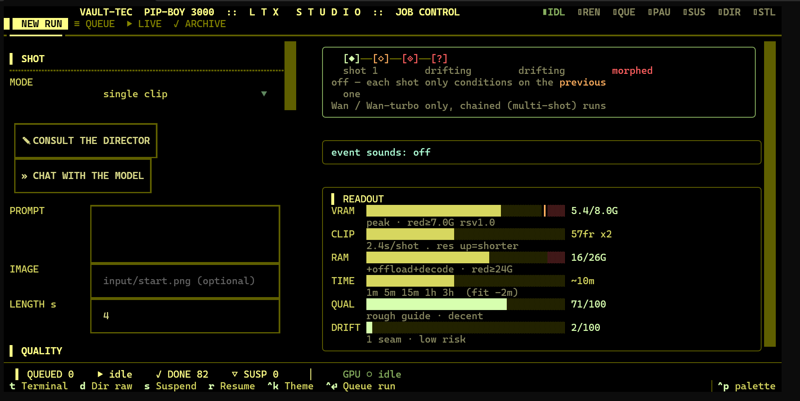

**A live render** — the worker subprocess streaming progress and a last-frame preview into the LIVE tab, with per-phase timing (load → warm → gen → decode → save):

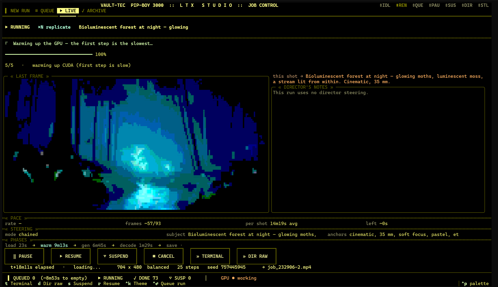

**The archive** — every run is a first-class record: status, per-run timing, favorites, and the blind-comparison harness (REVEAL / RATE PAIR / PAIR A/B). INSPECT shows a run's full config beside an opening-frame preview, so near-identical runs — especially replicates — can be told apart without opening a player:

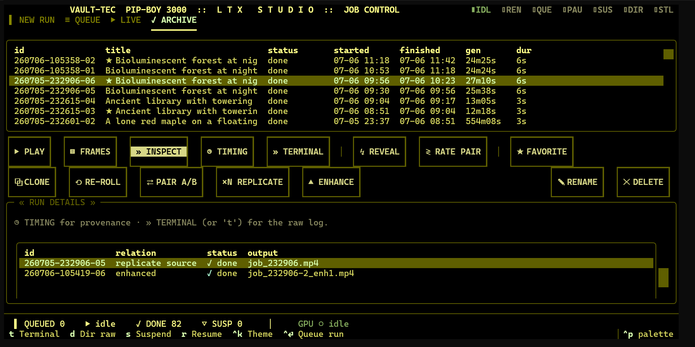

Scrolling the same panel reaches the lineage table — here a replicate source, a replicate sibling, and an enhanced child — so provenance survives re-rolls, replicates, and enhancement passes:

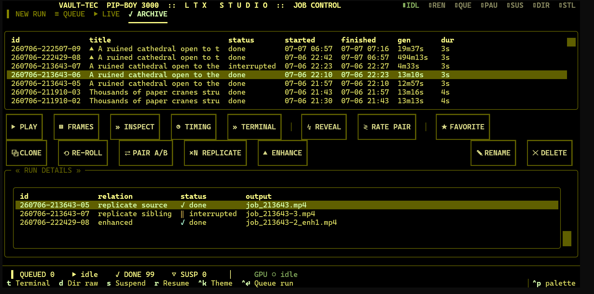

**Themeable** — the whole UI re-skins live: 21 hand-built Pip-Boy palettes, each modeled on a real reference object rather than a hue rotation, plus an opt-in *ultra* tier of 10 animated themes whose 8-bit decorations are pure functions of a 15 fps frame clock — zero cost to the render path. Each carries a rare *signature moment* on a shared irregular scheduler: a shooting star crosses the synthwave grid, a second sonar contact surfaces, the dead TV channel cuts to colour bars for a second — NO SIGNAL — then rolls on. Three of them, each shown on its NEW RUN and ARCHIVE screens:

**ultra-dragon** — imperial gold on black-crimson lacquer; a glimmering dragon coils across the schematic under 年, the Year of the Dragon.

| | |
|---|---|
| 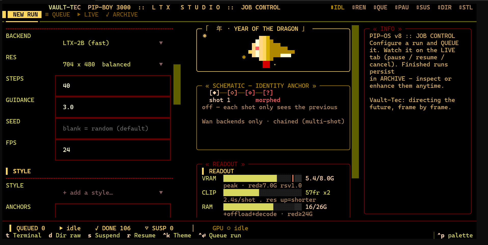 | 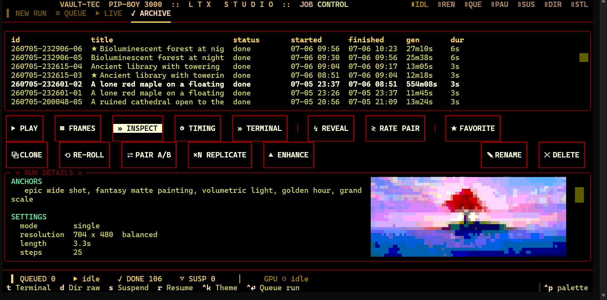 |

**ultra-synthwave** — the showpiece: a magenta/cyan/orange neon sunset with an OUTRUN sun and a scrolling perspective grid.

| | |
|---|---|
| 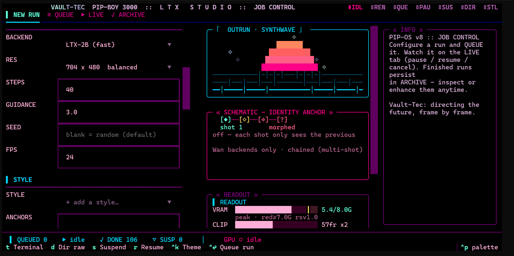 | 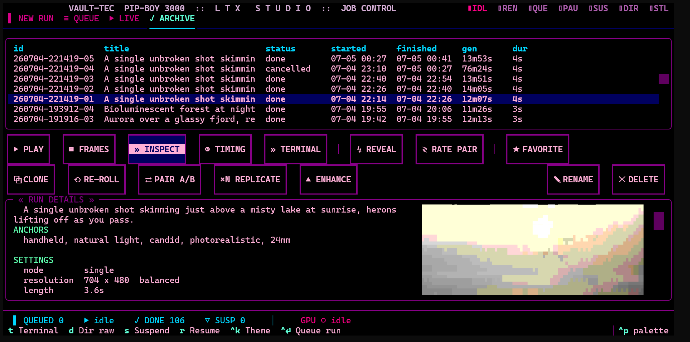 |

**ultra-sonar** — an abyssal cyan-green submarine scope; a sweep line rotates around a contact pinging at DEPTH 340.

| | |
|---|---|
| 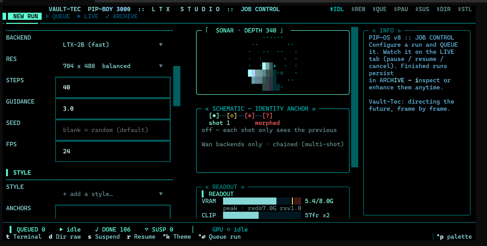 | 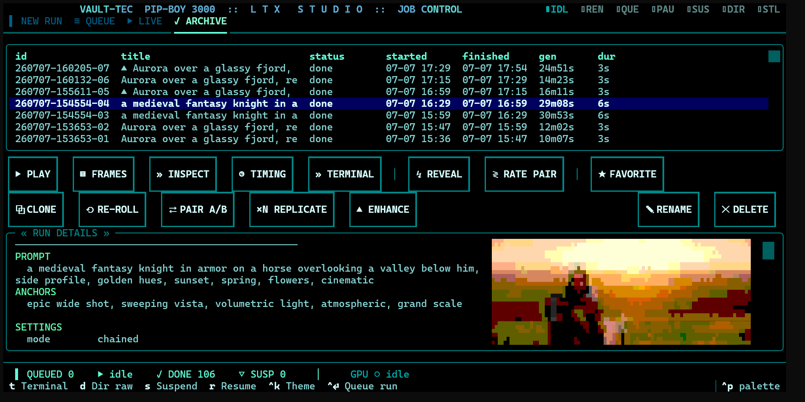 |

**Sample output** — all generated with the Wan backend, locally on the 8 GB laptop GPU:

| | |
|---|---|
|  |  |

*Left: fireflies over a glowing forest stream. Right: "bioluminescent forest at night — glowing moths, luminescent moss, a stream lit from within" (the run shown in the LIVE screenshot above). Full-quality clips: [job_105358-5.mp4](media/job_105358-5.mp4) · [job_232906-2.mp4](media/job_232906-2.mp4).*


*A corgi on the beach at golden hour — generated, upscaled ×4, and RIFE-interpolated end to end in about 15 minutes. Full clip: [corgi_redo-2.mp4](media/corgi_redo-2.mp4).*

**Two weeks in** — the first clip this project ever produced (June 22, the initial smoke test) happens to also be a dog on a beach. Next to it, the corgi above (July 6). No prior video-generation experience; same 8 GB card:

| June 22 — first output | July 6 |
|---|---|
| 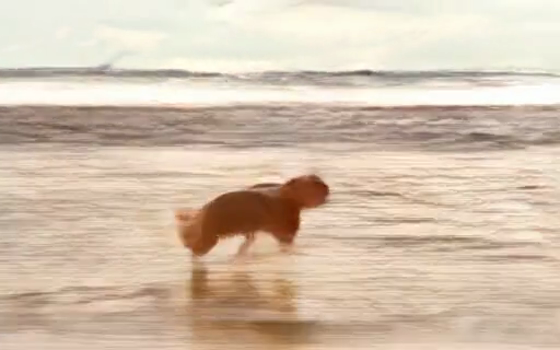 |  |

*The difference between the two columns is the rest of this README.*

---

## Why it looks the way it does

Three principles drove almost every design decision.

**1. The UI process never touches CUDA.**
The Textual app (`studio.py`) does not import `torch`. Generation runs in a *separate* Python subprocess with its own CUDA context. The worker reports to the UI over a small text protocol on stdout, and the UI controls the worker with POSIX signals (pause, suspend, cancel). A driver OOM or a CUDA segfault therefore kills the worker, not the UI: the studio stays responsive, reports the failure, and lets you re-queue. It also means the ~4,500-line UI stays testable without a GPU in the loop.

**2. Measure, don't guess.**
Every run the studio finishes (done or failed) appends a structured record to `runs/experiments.jsonl`: config, per-phase wall-clock, peak VRAM, and quality telemetry (seam MSE across shot boundaries, luminance drift against the shot-1 anchor, prompt token counts). The VRAM and time constants behind the READOUT gauges *refit themselves from that log*. When you want to know whether a change actually helped, there's a **blind A/B harness** with a double coin-flip (it randomizes both the on-screen label *and* the render order) and a reveal gate, so you rate output without knowing which variant you're looking at.

**3. New behavior ships as an opt-in toggle, defaulting to the old output.**
A quality lever that silently changes results poisons every future comparison. So new features (latent AdaIN and palette-lock anchors, the Wan reference anchor, CFG rescale / interval guidance, the distilled LTX variant) are dials that default to the previous behavior: byte-identical output unless you opt in. Experiments stay honest across versions.

---

## Architecture

```
┌────────────────────────────────────────────────────────────────┐
│  studio.py          Textual TUI  ·  never imports torch          │
│  (~4,500 lines)     NEW RUN · QUEUE · LIVE · ARCHIVE · blind A/B │
└─────────────────┬──────────────────────────────────────────────┘
                  │  spawns a worker subprocess, reads its stdout,
                  │  parses  [[MARKER]]  lines; signals for control
┌─────────────────┴──────────────────────────────────────────────┐
│  studio_core.py     JobManager  ·  process lifecycle, marker     │
│  (~600 lines)       parsing, phase-timing provenance, run JSON   │
└─────────────────┬──────────────────────────────────────────────┘
                  │  argv  →  python director.py … | run_ltx.py …
                  │           (own CUDA context)
┌─────────────────┴──────────────────────────────────────────────┐
│  director.py        Generation engine  ·  multi-shot chaining,   │
│  run_ltx.py         LTX / Wan backends, drift anchors, preview   │
│  (~1,500 lines)     + telemetry emission, resumable checkpoints  │
└────────────────────────────────────────────────────────────────┘
```

`run_ltx.py` handles short single-shot LTX runs; everything else (chained, director, Wan) goes through `director.py`.

### The marker protocol

The worker prints progress as line-oriented markers, and `studio_core` parses them with regexes to update job state. Arguments are space-separated. The worker-to-UI direction has no other channel: no shared memory, no RPC, no `torch` in the UI. In the other direction the studio sends `SIGSTOP`/`SIGCONT` to pause, `SIGUSR1` to suspend to a checkpoint, and kills the process group to cancel.

```
[[PHASE generating]]        ← phase boundary → drives provenance + the progress budget
[[LOAD 2 5 loading …]]      ← model-load sub-step 2 of 5, with a label
[[SEG 2 4]]                 ← shot 2 of 4 started
[[STEP 12 20]]              ← denoising step 12 of 20 within the current shot
[[VRAM 7270]]               ← CUDA peak MB so far (torch max_memory_allocated)
[[SEAMMSE 2 340]]           ← shot 2's boundary luminance MSE vs. the previous shot, ×100
[[DRIFT 2 118 41]]          ← shot 2's luminance drift vs. the shot-1 anchor, ×100, before/after correction
[[TOKENS 2 61]]             ← shot 2's prompt token count
[[CKPT 2 97]]               ← resumable checkpoint written after shot 2 (97 frames so far)
[[SUSPENDED runs/…_ckpt]]   ← worker parked itself at a checkpoint (SIGUSR1)
[[PLAN 3 …]] [[DIRECT …]]   ← director mode: the VLM's plan and rewritten prompt for a shot
[[DIRECT_MS 3 900 2100]]    ← director mode: VLM load / inference ms for shot 3
[[DCFG k=v …]]              ← director mode: the as-run config, for the audit trail
```

The worker also prints `[[PREVIEW n]]` when it writes a fresh preview frame, but the UI doesn't parse it; it polls the preview PNG's mtime instead.

Raw phases are `importing`, `loading`, `offload`, `warmup`, `generating`, `decoding`, `saving` and (director mode) `redirecting`; the UI groups them as load → warm → gen → decode → save. Because phase boundaries are explicit, the studio accumulates real per-phase timings per run. Those feed two things: a **wall-time progress bar** that knows decoding is slow and weights the bar accordingly, and the **self-calibrating ETA** that reads back the experiment log.

---

## Feature tour

- **Pip-Boy TUI**: NEW RUN form, live QUEUE, LIVE render view, ARCHIVE, and a persistent right-hand rail with field schematics and global READOUT meters. The layout adapts: the rail restacks under the form on narrow terminals (below ~109 columns), and short terminals (under 38 / 30 rows) shed lower-value LIVE strips so the controls stay visible.
- **Themeable UI**: 21 hand-built Pip-Boy palettes, each modeled on a real reference object (vault suit, nixie tube, radium dial) rather than a hue rotation, plus an opt-in *ultra* tier of 10 animated themes. Each ultra theme has a rare, irregularly scheduled *signature moment* (a shooting star, a second sonar contact, a NO SIGNAL cut-in). The ultra decorations render as pure functions of a frame clock on a dedicated 15 fps timer, cost nothing on the standard themes, and freeze under `STUDIO_NO_ANIM` (reduce motion).
- **Blind A/B**: queue two variants of one config, rate them blind, reveal after. Blinds and ratings are logged to `runs/pair_blinds.jsonl` / `runs/pair_ratings.jsonl`.
- **Live preview**: the worker projects a cheap RGB preview straight from the in-flight latent (no VAE decode). The UI redraws it as truecolor sub-cell terminal art (sextant / quadrant / half-block, cycled with Ctrl+P), so you can bail on a bad seed early.
- **READOUT gauges**: VRAM headroom, clip budget, system RAM, the shot chain, predicted quality, and drift risk. The VRAM slope and the time constants refit from your own run history (cached in `runs/readout_fit.json`), so those scales mean something on *your* hardware. RAM, quality and drift are labeled hand heuristics.
- **Field schematics**: a right-rail « SCHEMATIC » panel draws the focused dial's trade-off axis with your current value marked on it, beside an « INFO » panel whose guidance is per-dial *and* per-backend.
- **Style presets**: named bundles of anchor words (`Cinematic`, `Golden Hour`, `Noir`, …) that append to the ANCHORS field. They stack, and you can add your own in `runs/style_presets.json`. Anchors apply on chained, director and Wan runs; single-shot LTX runs don't use them.
- **Multi-shot director**: chains short shots into longer clips, with tail-overlap conditioning (or latent chaining) between shots, so every model pass stays inside the 8 GB budget. Drift is fought by anchoring to shot 1 with latent AdaIN and a pixel-space palette lock. An optional Qwen3-VL sidecar looks at each seam frame and rewrites the next shot's prompt toward your directive.
- **Suspend / resume**: press `s` to park a multi-shot run at a resumable checkpoint (`runs/<id>_ckpt/`), and `r` to pick it back up. Checkpoints survive a studio restart, and a stall sentry auto-suspends a wedged run.
- **Three generation paths**: LTX-2B (pinned 0.9.5) for fast drafts, Wan-VACE-1.3B for fidelity, and Wan-turbo, a Self-Forcing DMD distill LoRA that runs in about 6 steps (capped at 8). Each path's step/CFG clamps are surfaced rather than hidden. The 0.9.8-distilled LTX transformer is available as a blind-A/B variant or via `--ltx_variant distilled` on the CLI.
- **Enhance**: ▲ ENHANCE runs RIFE interpolation, upscaling, face restore and SeedVR2 passes on a finished run. This needs an external AnimateDiff checkout (see [Machine-specific paths](#machine-specific-paths)).
- **Consult the director**: ✎ CONSULT opens a Qwen3-VL chat that proposes dial settings and writes them into the form.
- **Archive with lineage**: every run is a first-class record: favorite, re-roll, clone, replicate, enhance, blind-pair verdicts, a lineage panel tracing each run's replicate source and enhanced children, and an opening-frame preview on inspect so near-identical runs are distinguishable at a glance.
- **Inspect & clone from the queue**: read-only provenance and one-click re-queue of any run's exact config.
- **Sounds**: short cues from `sfx/` on run start, done, stall and empty queue. Drop a `.wav` in the folder to add it to the pickers. Mute with `STUDIO_MUTE=1` or the settings toggle.

### Keys

| Key | Action |
|-----|--------|
| `Ctrl+Enter` | Queue the NEW RUN form |
| `Ctrl+K` | Theme picker |
| `Ctrl+P` | Cycle preview glyphs (sextant → quadrant → half); use it if the preview shows boxes |
| `s` / `r` | Suspend the running job / resume a suspended one |
| `t` | Toggle the raw worker terminal |
| `d` | Toggle director raw output |
| `Ctrl+C` | Quit |

---

## Repo map

| Path | Role |
|------|------|
| `studio.py` | The Textual TUI: forms, queue, live view, archive, blind A/B, readout, layout. The centerpiece. |
| `studio_core.py` | `JobManager`: subprocess lifecycle, `[[MARKER]]` parsing, phase-timing provenance, per-run JSON. |
| `studio_modals.py` | Modal screens (frame viewer, theme picker, pickers and confirms). |
| `studio_config.py` | Load/save of persisted settings in `runs/studio_config.json`. |
| `studio_themes.py` | Theme registry: 21 curated Pip-Boy palettes plus the 10-theme animated *ultra* tier. |
| `ultra_art.py` | Pixel-art / procedural decorations for the ultra themes: pure functions of a frame clock that never raise. |
| `field_visuals.py` | Block-art schematics for every form field. |
| `readout.py` | The self-calibrating READOUT gauges and their refit. |
| `preview_art.py` | PNG → truecolor sub-cell terminal art for previews, thumbnails and the frame viewer. |
| `dials_help.py` | Dial help text, shared by the UI tooltips and the VLM planner. |
| `style_presets.py` | Named anchor-word bundles for the STYLE dropdown. |
| `sounds.py`, `sfx/` | Event sound cues. |
| `director.py` | Multi-shot generation engine: LTX/Wan backends, drift anchors, checkpoints, telemetry emission. |
| `run_ltx.py` | Single-clip LTX runner: the studio's short-run path, and the `ltx.sh` CLI. See [LTX_README.md](LTX_README.md). |
| `ltx_preview.py` | Latent → RGB preview projection (LTX and Wan) used by the workers. |
| `gpu_budget.py` | VRAM cap / reserve helpers for the 8 GB envelope. |
| `experiment_log.py` | Appends structured run records to `runs/experiments.jsonl` (the measurement backbone), plus a pandas loader for analysis. |
| `vlm_director7b.py`, `vlm_planner.py` | Optional Qwen3-VL-4B sidecars: per-seam prompt rewriting (director mode) and the CONSULT planner. |
| `vlm_director.py` | Earlier Qwen2-VL-2B director prototype. Superseded by `vlm_director7b.py` and not used. |
| `ltx_studio.py` | The original single-file TUI. Superseded by `studio.py`; nothing launches it. |
| `ltx_calib.py` | One-off probe for the longest LTX clip that fits 8 GB per resolution (loads the old 0.9.0 base). |
| `tests/` | The CPU test suite; `tests/run.sh` runs everything (see [Testing](#testing)). |
| `_q2tests/`, `_t22tests/` | Harnesses from the quality sprint and the READOUT work: unit tests plus the GPU acceptance / stress scripts. |
| `_spikes/` | Research spikes (e.g. a Wan 2.2-5B smoke test), kept as a record of what was tried. |
| `media/` | README screenshots and sample clips. |
| `2026-07-*.md` | Implementation plans from past work sessions, kept for history. Their paths refer to the original checkout. |

---

## Running it

LTX Studio orchestrates open-weights models it does **not** vendor. You supply:

- A Python 3.10+ environment with the deps in `requirements.txt`.
- On Blackwell / RTX 50-series, a CUDA 12.8 build of PyTorch:
  `pip install torch --index-url https://download.pytorch.org/whl/cu128`
- The model weights, fetched on first use via `huggingface_hub` into the local HF cache: LTX-Video 0.9.5 (plus the base `Lightricks/LTX-Video` repo for its text encoder and tokenizer), and optionally Wan 2.1-VACE-1.3B and the Wan-turbo LoRA.

Then:

```bash
./studio.sh          # launch the studio TUI (stderr is mirrored to studio.err)
./ltx-studio.sh      # same, without the studio.err mirror
./ltx.sh --prompt "a fox trotting through snow" --seconds 5   # headless single clip, no TUI
```

All three launchers pick the interpreter in this order: `$LTX_PYTHON`, then the active `$VIRTUAL_ENV`, then `./venv`, then `python3`.

### Environment variables

| Variable | Effect |
|----------|--------|
| `LTX_PYTHON` | Interpreter for the launchers and `tests/run.sh`. |
| `STUDIO_MUTE=1` | Silence all sound cues. |
| `STUDIO_NO_ANIM` | Any non-empty value freezes the ultra-theme animation at frame 0 (reduce motion). |
| `PREVIEW_MODE` | Starting preview glyph set: `sextant` (default), `quadrant` or `half`. |
| `STUDIO_PREVIEW_SEC` | Minimum seconds between worker preview frames (default 15). |
| `LTX_GPU` | GPU label recorded in each experiment-log row. |

### Machine-specific paths

The core loop (TUI → worker → LTX/Wan) is portable. Three optional features expect external installs, and their defaults point at the author's machine. Override them with these variables:

| Variable | Used by | Default |
|----------|---------|---------|
| `LTX_ANIMATEDIFF_REPO` | ▲ ENHANCE (RIFE / upscale / face), run with that repo's `venv/bin/python` | `/home/wolve/video_gen/AnimateDiff` |
| `LTX_DIRECTOR_PY` | The Qwen3-VL sidecars (director-mode seam rewriting and ✎ CONSULT). Point it at a separate venv with `transformers>=4.57`, `bitsandbytes` and `qwen-vl-utils`. | `/home/wolve/video_gen/director_venv/bin/python` |
| `LTX_QWEN_4B_DIR` / `LTX_QWEN_8B_DIR` | Pre-quantized nf4 Qwen3-VL weights. If the directory is missing, the director sidecar quantizes the HF model at load time and CONSULT falls back to the CPU. | `/home/wolve/video_gen/qwen3vl{4b,8b}_nf4` |

It was built on WSL2 on Windows with an 8 GB GPU. The ▶ PLAY button opens files through `explorer.exe`, `wslview` or PowerShell, so it assumes WSL. Everything else is a terminal app plus a subprocess.

---

## Testing

The suite runs on the CPU and never touches CUDA. It covers parsing, the build() command matrix, layout, themes, timers, readout math and the ultra-art invariants:

```bash
./venv/bin/pip install pyflakes     # the lint test needs it
tests/run.sh                        # all tests/test_*.py + the two harness suites
```

Each test is a standalone script that exits nonzero on failure. `run.sh` sets `STUDIO_MUTE=1` so automation never makes a sound. `_q2tests/test_units.py` (palette lock, AdaIN, overlap fuse, experiment-log export) imports `director.py`, so it needs the full worker deps (`torch`, `diffusers`); a CPU-only torch build is enough.

The strict separation between the UI process and the CUDA worker is what makes this possible: the interesting logic lives on the testable side of the process boundary.

---

## License

MIT — see [LICENSE](LICENSE).
